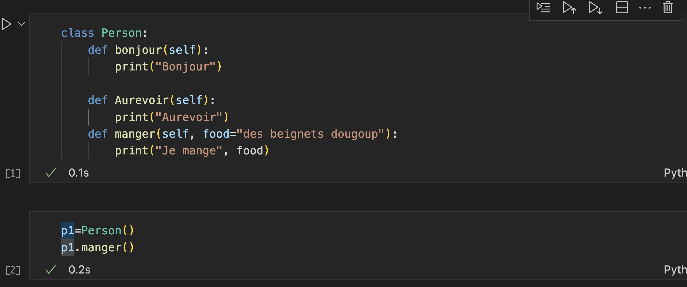
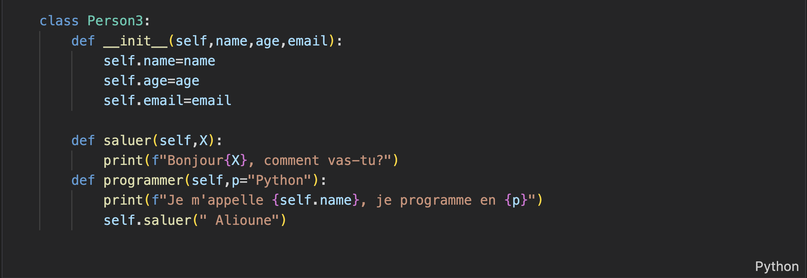
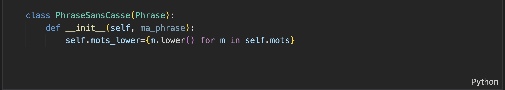
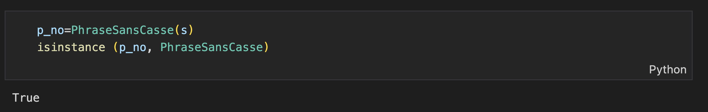

# Rapport cours python: 
## Notions de Classes, Instances et Méthodes
effectué par ***Alioune MBODJI***

### Les classes:

- Une classe nous permet de définir notre propre type.
- A chaque appel d’une classe, on aura la création de nouvelles instances.
- On parle de relation d’héritage entre les classes et les instances.
- Les instances vont pouvoir hériter de tous les attributs de l’espace de nommage de la classe.

  - Illustration:

  {width=6in} 

### Les instances et les méthodes:

- Les classes et les objets sont des objets mutables.
- Les méthodes sont des fonctions définies à l’intérieur de la classe.
- Les classes et les instances ont leurs propres espaces de nommage
- Lorsqu’on ne trouve pas un attribut dans l’espace de nommage d’une instance, faudra remonter l’arbre d’héritage afin de le trouver au niveau de la classe. 
 
 - Illustration:

 {width=6in}

### Les méthodes spéciales:

- Les méthodes spéciales commencent par des « __ »  et se terminent de la même manière.
- Les méthodes spéciales permettent aux instances d’avoir le même comportement que les objets buil-in. 
- La méthode (_init_) est une méthode spéciale qui permet d’initialiser des instances avec des valeurs par défauts. 

 - Illustration avec la méthode spéciale init: 

 {width=6in}

 ### Les héritages: 

- Par définition les classes peuvent héritées d’autres classes.
- Les classes supérieures sont appelées des super-classes et celles inférieures des sous-classes: on a un arbre d’héritage entre elles.
- Lorsqu’une classe hérite d’une autre alors naturellement elle hérite de toutes ses méthodes.
- Une classe hérite d’une autre lorsqu’elle est un argument de cette dernière.

 - Illustration: 

 {width=6in}

- PhraseSansCasse va hériter de la classe phrase.
- isinstance nous permet de vérifier si un objet est une instance directe d’une classe ou une instance des super classes qui ont instancié l’objet.

 - Illustration de isinstance: 

 {width=6in}

 **Initialisation d'une sous-classe**:

 - On parle de surcharge d’une classe lorsqu’on initialise notre sous-classe avec la méthode (_init_), ainsi la méthode (_init_) de la super-classe ne sera pas appelée par défaut à moins qu’on la force.

  - Illustration:

  {width=6in}

